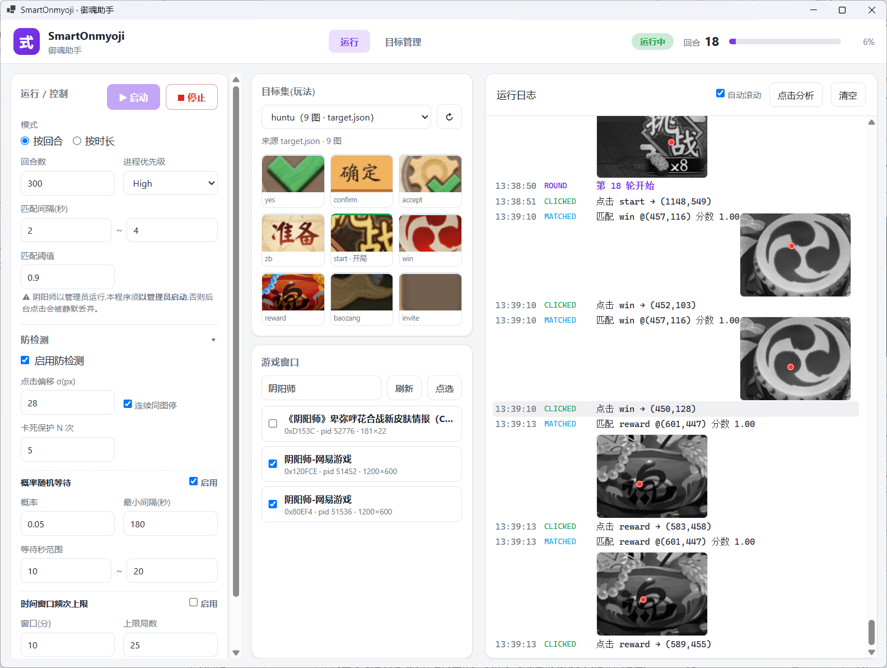

# SmartOnmyoji

> 阴阳师桌面版后台助手:后台截图 → 图像匹配 → 拟人化后台点击,自动化重复的日常操作。

**C# / .NET 9** 实现(Web 前端 + 原生后端,WebView2 承载 UI),基于
[aicezam/SmartOnmyoji](https://github.com/aicezam/SmartOnmyoji)(原作者已弃坑)重写而来。
旧版 Python + PyQt5 实现保留在 [`python-legacy/`](python-legacy/) 仅供参考。

详细架构设计见 [`docs/csharp-rewrite-design.md`](docs/csharp-rewrite-design.md)。

界面截图(当前 C# 版 WebUI):



## ⚠️ 使用风险提示

请谨慎使用此类辅助脚本,所有不公平的游戏行为都可能被官方检测到并导致封号。坐标偏移越小、点击频率越快,
越容易被检测。建议:不要用默认的"高强度"参数长期挂机,适当调大随机等待概率、点击偏移范围,
并保持在正常的游戏时长内使用。

## 功能特性

- **后台截图 + 模板匹配**:不抢前台、不遮挡鼠标,后台截取游戏客户区并与目标图片逐一比对,取匹配分数最高且达到阈值的位置。
- **拟人化后台点击**:命中位置加截断正态分布的随机偏移(偏向窗口内侧、按目标所在方位调整),点击前后随机停顿,而非在同一像素反复点击。
- **防检测策略**:可选的"概率随机等待"(按概率/最小间隔触发一段随机等待)与"时间窗口频次上限"(单位时间内匹配局数超限则强制多等一会儿),以及连续匹配同一目标 N 次自动终止的卡死保护。
- **回合状态机**:目标图片可标记 `start`(回合开始)/`mark`(标记)/`skip`(跳过)/`stop`(终止),驱动回合计数与提前结束逻辑。
- **多窗口并行**:一次运行可勾选多个游戏窗口,每个窗口各自独立截图/匹配/点击,互不影响。
- **目标集全部由 WebUI 管理**:建集、在软件内截图后框选取模板、设置 flag/优先级(按图片顺序 + 拖拽排序)、在截图上点选自定义点击偏移点——全程不需要手改 JSON。
- **实时运行日志**:结构化事件流,日志里内联显示命中缩略图;运行结束后可查看本次运行的点击落点分析(仅内存统计,不落盘)。

## 环境要求

- **仅支持 Windows**(10/11);游戏本身通常以管理员权限运行,因此本程序也**必须以管理员身份启动**——
  否则合成的后台点击会被 Windows UIPI 静默丢弃(`SendMessage` 依然返回成功,非常具有迷惑性)。
- 从源码构建/运行需要 [.NET 9 SDK](https://dotnet.microsoft.com/download/dotnet/9.0)。
- 桌面壳(`ui` 模式)依赖系统的 **WebView2 运行时**(多数 Win10/11 已自带;没有的话装
  [Evergreen Runtime](https://developer.microsoft.com/microsoft-edge/webview2/) 即可)。若不想装 WebView2,
  可以用 `serve` 模式,直接用系统浏览器打开。

## 快速开始

克隆本仓库后,在**管理员终端**里:

```bash
# 构建
dotnet build SmartOnmyoji.sln

# 桌面模式:开一个 WebView2 窗口,指向本机起的 Kestrel 服务
dotnet run --project src/SmartOnmyoji.Host -- ui

# 或者 headless 模式:只起服务,自己用浏览器打开 http://127.0.0.1:8770
dotnet run --project src/SmartOnmyoji.Host -- serve 8770
```

打开后:「运行」页签选目标集(玩法)、勾选游戏窗口、按需调整运行参数与防检测选项,点「开始」即可;
「目标管理」页签用来新建/编辑目标集,全部操作(截图取模板、设置优先级、点选点击偏移)都在界面里完成。

不涉及操作游戏的命令(单测、`list`、`capture`、`match` 等只读诊断)不需要管理员权限,详见
[`CLAUDE.md`](CLAUDE.md) 里的冒烟命令列表。

## 打包发行

```bash
dotnet publish src/SmartOnmyoji.Host -p:PublishProfile=win-x64
```

产出自包含单文件 exe(免装 .NET 运行时),连同目标集数据一起放在仓库根目录的 `release/win-x64/` 下,
开箱即用。暂无预编译版本,需自行从源码打包。

## 目标集(`img/`)

`img/` 下每个子目录是一个"玩法"目标集(如自带的 `yuling`/`huntu`/`huodong`),目录里是模板图片 +
`target.json`(记录每张图的 flag、优先级、可选的点击偏移点)。这些全部通过 WebUI 的「目标管理」
页签维护,不需要手动编辑 JSON。

## 项目结构

```text
SmartOnmyoji.sln          解决方案(根目录)
src/                      SmartOnmyoji.Core / Vision / Windows / Host 四个项目
tests/                    单元测试(纯逻辑,离线可跑)
docs/                     架构设计文档(单一事实来源)
img/                      目标集数据(gitignore,不入库)
python-legacy/            旧版 Python + PyQt5 实现(仅供行为参照)
```

## 旧版 Python(`python-legacy/`)

旧版 Python + PyQt5 实现保留在 [`python-legacy/`](python-legacy/) 目录里,可独立运行:

```bash
cd python-legacy
uv sync
uv run smart_onmyoji_start.py
```

## 致谢与 License

本项目是 [aicezam/SmartOnmyoji](https://github.com/aicezam/SmartOnmyoji) 的重写与延续,感谢原作者的工作。
仅作学习用途,请勿用于其他非法途径。License 见 [LICENSE](LICENSE)(MIT)。